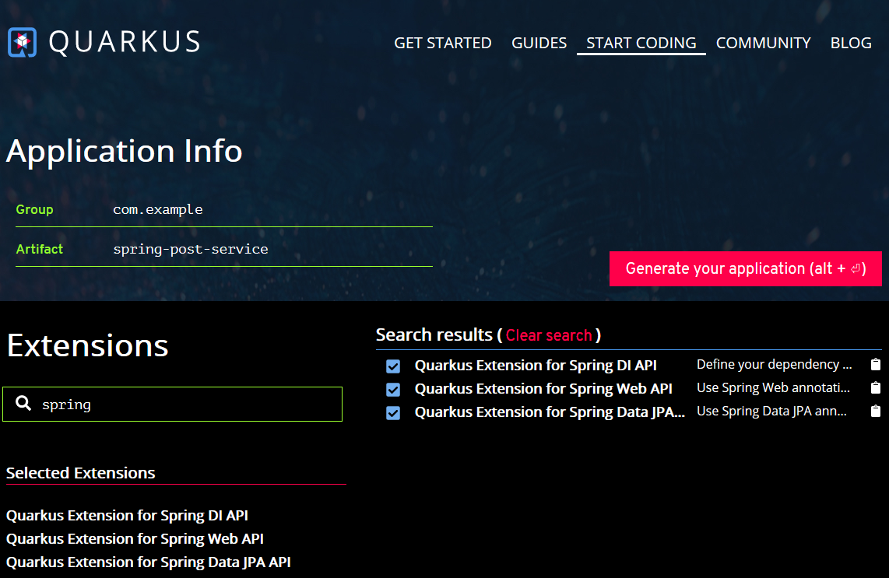

# Building a Spring application with Quarkus

In the [last post](./01-start.md), we have created a simple Quarkus application. For those who are familiar with Spring it is better to code in their way. Luckily, Quarkus supports Spring out of box. 

There are some Quarkus extensions available to support Spring framework.

*  spring-di - Spring core framework
*  spring-web - Spring WebMVC framework
*  spring-data - Spring Data JPA integration

In this post, we will create a Quarkus application with similar functionality in the last post but here we are using the Spring extensions. 

## Generate a Quarkus project skeleton

 Similarly, open your browser and navigate to  [Starting Coding](https://code.quarkus.io) page.

1. Input **spring**  in the *Extensions* text box to filter the extensions.

 

2. Select all *Spring* related extensions, and customize the value of **group** and  **artifactId** fields as you like. 
3. Hit the **Generate your application** button or use the keyboard shortcuts **ALT+ENTER**  to produce the project skeleton into an archive for downloading.

4. Download the archive file, and extract the files into your disk, and import them into your  favorite IDE.

Next, we'll add some codes to experience the Spring related extensions.

##  Enabling JPA Support

First of all, you need to configure a  `DataSource`  for the application.  

```properties
# configure your datasource
quarkus.datasource.url = jdbc:postgresql://localhost:5432/blogdb
quarkus.datasource.driver = org.postgresql.Driver
quarkus.datasource.username = user
quarkus.datasource.password = password

# drop and create the database at startup (use `update` to only update the schema)
quarkus.hibernate-orm.database.generation = drop-and-create
quarkus.hibernate-orm.log.sql=true
```

Using `quarkus:list-extensions` goal to list all extensions provided in Quarkus, there are a few jdbc extensions available.  

Let's use PostgresSQL as an example, and add the *jdbc-postgresql* extension into the project dependencies.

Open your terminal, execute the following command in the project root folder.

```bash
mvn quarkus:add-extension -Dextension=jdbc-postgresql
```

Finally,  a new `quarkus-jdbc-postgresql` artifact is added in the `pom.xml` file.

```xml
<dependency>
    <groupId>io.quarkus</groupId>
    <artifactId>quarkus-jdbc-postgresql</artifactId>
</dependency>
```

Let's reuse the `Post` entity we created in the last post, and create a `Repository` for this  `Post` entity.

## Creating a Spring Data specific Repository

 The following is an example of `PostRepository`.  `JpaRepository` is from Spring Data JPA project which provides common operations  for JPA. 

```java
public interface PostRepository extends JpaRepository<Post, String>{}
```

Currently it seems only the basic `Repository` is supported, a lot of attractive features are missing  in the current Quarkus Spring Data support, including:

* QueryDSL and JPA type-safe Criteria APIs, see [#4040](https://github.com/quarkusio/quarkus/issues/4040)
* ~~Custom Repository interface, see [#4104](https://github.com/quarkusio/quarkus/issues/4104), [#5317](https://github.com/quarkusio/quarkus/issues/5317)~~, fixed in the *master* branch and will be available in 1.1.

Create a custom interface `PostReposiotryCustom`.

```java
public interface PostRepositoryCustom {
    List<Post> findByKeyword(String q, int page, int size);
}
```

Make   `PostRepository` to extend `PostRepositoryCustom`.

```java
public interface PostRepository extends JpaRepository<Post, String>, PostRepositoryCustom{...}
```

Provides a implementation for  `PostReposiotryCustom`. 

```java
public class PostRepositoryImpl implements PostRepositoryCustom {
    
    private static final Logger LOGGER = Logger.getLogger(PostRepositoryImpl.class.getName());
    
    @PersistenceContext
    EntityManager entityManager;

    @Override
    public List<Post> findByKeyword(String q, int offset, int limit) {
        LOGGER.info("q:" + q + ", offset:" + offset + ", limit:" + limit);
        CriteriaBuilder cb = this.entityManager.getCriteriaBuilder();
        CriteriaQuery<Post> query = cb.createQuery(Post.class);
        Root<Post> root = query.from(Post.class);
        if (!StringUtils.isEmpty(q)) {
            query.where(
                    cb.or(
                            cb.like(root.get(Post_.title), "%" + q + "%"),
                            cb.like(root.get(Post_.content), "%" + q + "%")
                    )
            );

        }
        return this.entityManager.createQuery(query)
                .setFirstResult(offset)
                .setMaxResults(limit)
                .getResultList();
    }
}
```

The `findByKeyword` method uses JPA Criteria APIs to filter posts by keyword, and also paginated the result by `offset` and `limit` parameter.


## Creating a RestController

Create a  `@RestController`  to expose  `Post` resources.

```java
@RestController
@RequestMapping("/posts")
public class PostController {
    private final static Logger LOG = Logger.getLogger(PostController.class.getName());
    private PostRepository postRepository;

    public PostController(PostRepository postRepository) {
        this.postRepository = postRepository;
    }

    @GetMapping()
    public ResponseEntity getAllPosts() {
        List<Post> posts = this.postRepository.findAll();
        return ok(posts);
    }

    @GetMapping(value = "/{id}")
    public ResponseEntity<Post> getPost(@PathVariable("id") String id) {

        Post post = this.postRepository.findById(id).orElseThrow(
                () -> new PostNotFoundException(id)
        );

        return ok(post);
    }

    @PostMapping()
    public ResponseEntity<Void> createPost(@RequestBody @Valid PostForm post) {
        Post data = Post.of(post.getTitle(), post.getContent());
        Post saved = this.postRepository.save(data);
        URI createdUri = UriComponentsBuilder.fromPath("/posts/{id}")
                .buildAndExpand(saved.getId())
                .toUri();

        return created(createdUri).build();
    }

    @PutMapping(value = "/{id}")
    public ResponseEntity<Void> updatePost(@PathVariable("id") String id, @RequestBody @Valid PostForm form) {
        Post post = this.postRepository.findById(id).orElseThrow(
                () -> new PostNotFoundException(id)
        );
        post.setTitle(form.getTitle());
        post.setContent(form.getContent());
        this.postRepository.save(post);

        return noContent().build();
    }

    @DeleteMapping(value = "/{id}")
    public ResponseEntity<Void> deletePostById(@PathVariable("slug") String id) {
        this.postRepository.deleteById(id);
        return noContent().build();
    }

}

```
Currently, there are some limitation when creating a `RestController`.

- The return type does not support `Page`, see [#4056](https://github.com/quarkusio/quarkus/issues/4056)
- The request parameter `@PageableDefault` `Pageable` is not supported, see [#4041](https://github.com/quarkusio/quarkus/issues/4041)

In the `getPost` method of the `RestController` class, there is a `PostNotFoundException`  thrown when a post is not found , let's create a `ControllerAdvice` to handle it .

```java
@RestControllerAdvice
public class PostExceptionHandler {

    @ExceptionHandler(PostNotFoundException.class)
    public ResponseEntity notFound(PostNotFoundException ex/*, WebRequest req*/) {
        Map<String, String> errors = new HashMap<>();
        errors.put("entity", "POST");
        errors.put("id", "" + ex.getSlug());
        errors.put("code", "not_found");
        errors.put("message", ex.getMessage());

        return status(HttpStatus.NOT_FOUND).body(errors);
    }

}
```

There is a limitation  here , `@ExceptionHandler` method can not accept Spring specific parameters, see [#4042](https://github.com/quarkusio/quarkus/issues/4042).   If you need to access the  HTTP request, try to replace the `WebRequest` with the raw Servlet based `HttpServletRequest`.

Get the source codes from my [Github](https://github.com/hantsy/quarkus-sample).